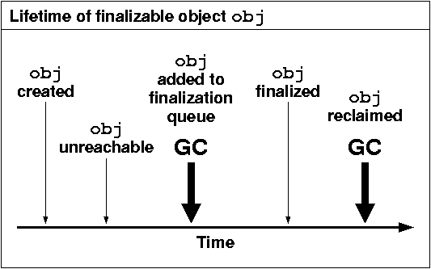

# finalizer와 cleaner 사용을 피하라
finalizer와 cleaner는 객체 소멸자로 cleaner는 Java9에서 대안으로 소개되었다.
### finalizer?
finalize는 Object에 있는 메소드로 다음과 같은 형태이다.
```java
protected void finalize() throws Throwable {
}
```
finalize는 객체가 GC에 소멸되기 전에 수행되며 객체가 GC에 의해 Heap 메모리에서 제거될 때 딱 한번 호출된다.
일반적으로 finalize 메소드가 Override가 되어있다면 GC에 의해 바로 Collection 되지 않고 Finalization queue에 등록된 후 Finalizer에 의해 정리가 된다.



[Finalization 객체 상태](https://slideplayer.com/slide/3607586/)
### finalizer 단점
finalizer는 예측 불가능성, 위험성 존재하기에 불필요하다.
1. 즉시 수행된다는 보장이 없다.
- finalizer나 cleaner를 얼마나 신속히 수행할지는 GC 알고리즘에 달려있다.
  - GC의 대상이 된다고 해서 바로 수행되는 것은 아님
- finalizer로 인해 자원 회수가 지연될 수 있다.
2. 자바 언어 명세는 finalizer나 cleaner의 수행 시점뿐 아니라 수행 여부조차 보장해주지 못한다.
- 따라서 상태를 영구적으로 수행하는 작업에서는 절대 finalizer나 cleaner에 의존해서는 안 된다.(ex. 공유 자원의 영구 락 해제)
- System.gc, System.runFinalization으로도 메서드의 수행을 보장해주지 못한다.
3. finalizer 동작 중 발생한 예외는 무시되고, 나머지 작업이 남았더라도 종료된다.
4. finalizer와 cleaner은 성능 문제도 동반한다.
- try-with-resources와 비교했을 때 finalizer는 GC의 성능을 떨어뜨리기 때문에 더 느리다.
5. finalizer를 사용한 클래스는 finalizer 공격에 노출되어 심각한 보안 문제를 일으킬 수 있다.
```java
public class Example {
    static Example example;
    
    protected void finalize() {
        example = this;
    }
}
```
[링크](https://yangbongsoo.gitbook.io/study/finalizer-attack)
- final로 finalize를 override하는 것을 막거나 final class로 상속을 막는 것이 대안
### 대안
- AutoCloseable을 구현하고 인스턴스를 다 쓴 다음 close를 호출(try-with-resources 활용)
- 혹은 사용자가 자원을 close를 하지 않았을 경우 안전망으로서의 역할(FileInputStream, FileOutputStream, ThreadPoolExecutor)
- native peer(일반 자바 객체가 네이티브 메서드를 통해 기능을 위임한 네이티브 객체)는 자바 GC가 알지 못하기 때문에 finalizer가 필요

### Cleaner
```java
public class Room implements AutoCloseable {
    private static final Cleaner cleaner = Cleaner.create();

    private static class State implements Runnable {
        int numJunkPiles; // 수거할 자원(정확하게는 포인터 (long)를 수거하는 상황이 현실적)

        State(int numJunkPiles) {
            this.numJunkPiles = numJunkPiles;
        }

        @Override public void run() { // Cleanable을 통해 한번만 호출됨(close or GC) 
            System.out.println("Cleaning room");
            numJunkPiles = 0;
        }
    }

    private final State state;

    private final Cleaner.Cleanable cleanable;

    public Room(int numJunkPiles) {
        state = new State(numJunkPiles);
        cleanable = cleaner.register(this, state);
    }

    @Override public void close() {
        cleanable.clean();
    }
}
```